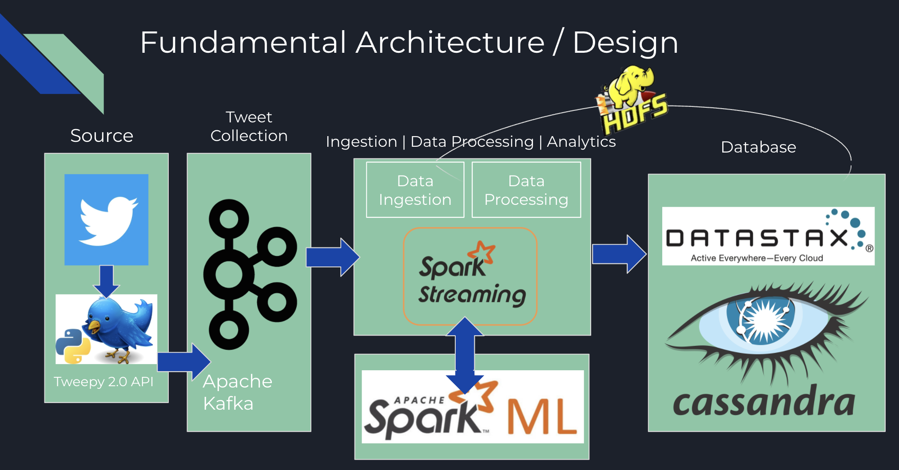
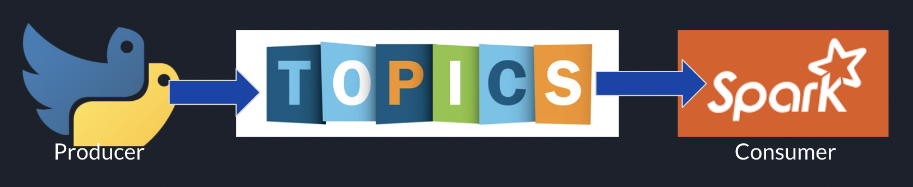

<h1 align="center">Real-Time Tweet Classification Project</h1>

# Project Description

This project utilises elements of the Hadoop Ecosystem and the Tweepy 2.0 API to provide a means by which large retailers such as 'ASOS' can automate online customer support. This project was created to assist me in getting my first junior data engineer role to which it was successful, and so I am providing it to assist others aspiring to do the same.

Business Use Case

ASOS is a British Fashion Retailer who frequently get tweeted at with various complaints regarding user orders. Despite this, after a quick look online you will find that they rarely respond to offer assistance.

This projects solution is to gather tweets in real-time and perform ML / NLP to classify whether or not a tweet is a complaint / if someone requires assistance with an order. This can then be output to a database so that bots can later be used to deliver automated responses.

# Fundamental Architecture / Design
The projects design is made up of multiple components as outlined below.

1. Tweepy 2.0 API.
2. Apache Kafka + Zookeeper
3. Apache Spark (Structured Streamimg) + SparkML
4. Datastax Cassandra

Tweepy 2.0

Tweepy is an open-sourced easy to use python library that allows you to utilise the Twitter API. This API allows you to pull specific fields such as tweet text, username, whether a tweet is a retweet.etc. This is utilised to pull text in real-time as well as to build up a dataset of sample tweets for us to classify.

Apache Kafka + Zookeeper

Kafka is an open-source distributed event streaming platform used for high-performance data pipelines alongside streaming analytics and integration. It allows for a extremely high throughput at low latencies, is highly scalable and fault tolerant making it ideal for gathering and processing large streams of twitter data in this project.

Importantly, it uses a pub-sub model organised around topics, producers and consumers. All kafka messages are organised into a given topic where consumers pull messages and producers push messages.

For this to work however, it is worth noticing that zookeeper is required. Zookeeper manages the state of Kafka, without it this project cannot function.

Apache Spark + SparkML

Our consumer is that of Apache Spark utilising Structured Spark Streaming. Spark is an analytics engine for large-scale data processing and provides implicit parallelism and fault tolerance.

Datastax Cassandra

