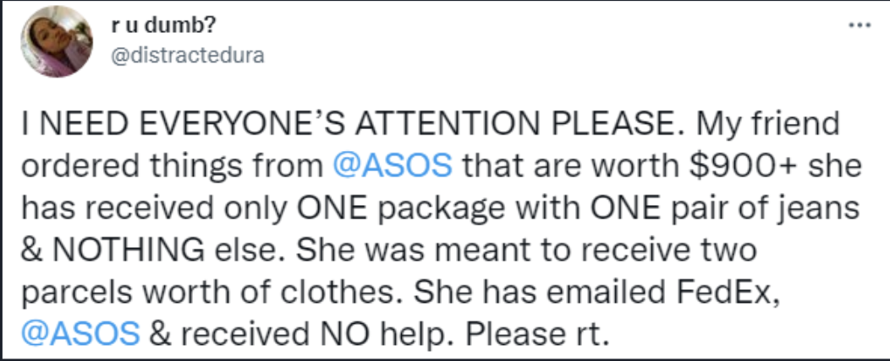

<h1 align="center">Real-Time Tweet Classification Project</h1>

# Project Description

This project utilises elements of the Hadoop Ecosystem and the Tweepy 2.0 API to provide a means by which large retailers such as 'ASOS' can automate online customer support. This project was created to assist me in getting my first junior data engineer role to which it was successful, and so I am providing it to assist others aspiring to do the same.

Business Use Case

ASOS is a British Fashion Retailer who frequently get tweeted at with various complaints regarding user orders. Despite this, after a quick look online you will find that they rarely respond to offer assistance.

